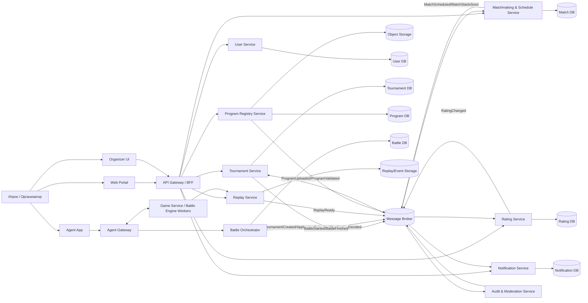
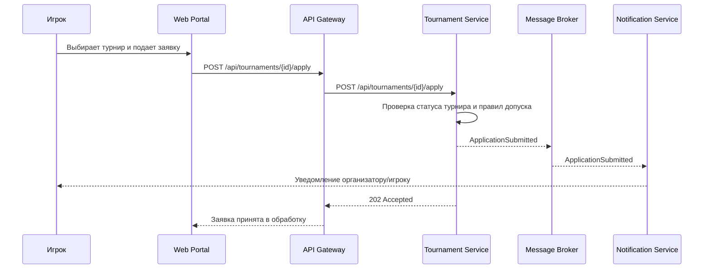
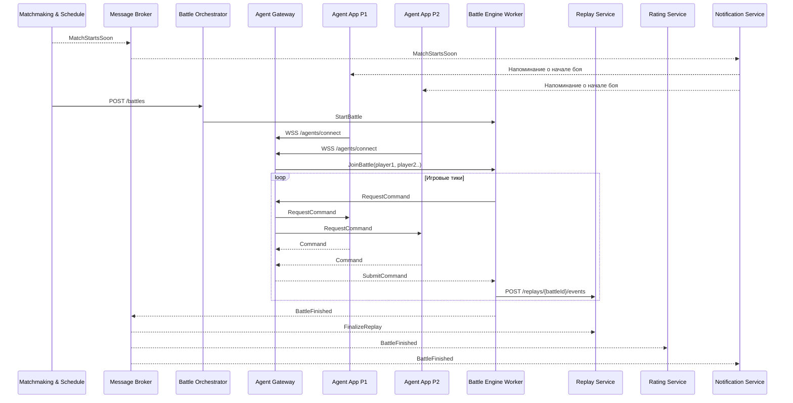

# Микросервисная архитектура игры "Космический бой"

## Контекст

"Космический бой" - игра для зарегистрированных пользователей. Игроки участвуют в боях через загружаемые программы, которые выполняются в приложении "Агент". Бои проходят в турнирах или по договоренности между пользователями. Система должна поддерживать заявки на турниры, приглашения, расписание боев, уведомления, рейтинги, просмотр прошедших боев и регулярные турниры с накопительным рейтингом.

## Основные приложения и микросервисы

### Клиентские приложения

| Приложение | Назначение | Внешние endpoints |
|---|---|---|
| Web Portal | Регистрация, вход, просмотр турниров, заявок, результатов, рейтингов, повторов боев | HTTPS через API Gateway |
| Organizer UI | Создание турниров, приглашение участников, управление расписанием | HTTPS через API Gateway |
| Agent App | Запуск программы игрока, подключение к бою, обмен командами с Battle Engine | WSS/gRPC через Agent Gateway |

### Backend-сервисы

| Сервис | Ответственность | Основные endpoints |
|---|---|---|
| API Gateway / BFF | Единая точка входа для Web Portal и Organizer UI, проверка токенов, rate limit, агрегация данных | Маршрутизация запросов `/api/*` |
| User Service | Регистрация, аутентификация, профили и статистика пользователей | `POST /api/users/register`, `POST /api/users/login`, `GET /api/users/{userId}/profile` |
| Tournament Service | Турниры, заявки, приглашения, сетки, участники и результаты | `POST /api/tournaments`, `GET /api/tournaments`, `POST /api/tournaments/{tournamentId}/apply` |
| Matchmaking & Schedule Service | Договорные бои, расписание матчей, стартовые слоты, напоминания о скором начале | `POST /matches/friendly`, `POST /matches/{id}/accept`, `GET /matches/{id}`, `POST /matches/{id}/schedule`, `GET /users/{id}/matches` |
| Program Registry Service | Загрузка, хранение метаданных и версий программ игроков, запуск проверки | `POST /programs`, `GET /programs/{id}`, `GET /users/{id}/programs`, `POST /programs/{id}/validate`, `PATCH /programs/{id}/active` |
| Agent Gateway | Подключение Агентов, heartbeat, авторизация агента в конкретный бой, маршрутизация команд | `WSS /agents/connect`, `POST /agents/{id}/heartbeat`, `POST /agents/{id}/battles/{battleId}/join` |
| Battle Orchestrator | Создание инстансов боя, выделение Battle Engine, контроль жизненного цикла боя | `POST /battles`, `POST /battles/{id}/start`, `POST /battles/{id}/cancel`, `GET /battles/{id}` |
| Game Service / Battle Engine Workers | Создание и исполнение боя, обработка команд, расчет состояния игрового мира | `POST /api/games`, `POST /api/games/{gameId}/move`, `GET /api/games/{gameId}/state` |
| Replay Service | Сохранение журнала событий боя и отдача повтора | `GET /api/replays/game/{gameId}`, `GET /api/replays/user/{userId}`, `POST /api/replays/analyze` |
| Rating Service | Рейтинг игроков и турниров, начисление очков за места, накопительный рейтинг регулярных турниров | `GET /api/ratings/user/{userId}`, `GET /api/ratings/tournament/{tournamentId}`, `POST /api/ratings/calculate` |
| Notification Service | Уведомления о приглашениях, заявках, завершении боя, скором начале боя | `POST /api/notifications`, `GET /api/notifications/user/{userId}`, `WS /ws/notifications` |
| Audit & Moderation Service | История действий, спорные результаты, подозрительные программы или бои | `GET /audit/events`, `POST /moderation/cases`, `PATCH /moderation/cases/{id}` |

## Endpoints микросервисов

Все внешние HTTP endpoints публикуются через API Gateway. Для изменения данных требуется JWT access token. Идентификатор пользователя из URL должен совпадать с владельцем токена либо вызывающий пользователь должен иметь соответствующую административную роль.

### User Service

| Метод | Endpoint | Назначение |
|---|---|---|
| `POST` | `/api/users/register` | Регистрация пользователя |
| `POST` | `/api/users/login` | Аутентификация и выдача токенов |
| `GET` | `/api/users/{userId}/profile` | Получение профиля |
| `PUT` | `/api/users/{userId}/profile` | Полное обновление профиля |
| `GET` | `/api/users/{userId}/stats` | Статистика игрока |

### Tournament Service

| Метод | Endpoint | Назначение |
|---|---|---|
| `POST` | `/api/tournaments` | Создание турнира |
| `GET` | `/api/tournaments` | Список будущих, текущих и завершенных турниров |
| `GET` | `/api/tournaments/{tournamentId}` | Карточка турнира |
| `PUT` | `/api/tournaments/{tournamentId}` | Обновление настроек турнира |
| `POST` | `/api/tournaments/{tournamentId}/apply` | Подача заявки на участие |
| `GET` | `/api/tournaments/{tournamentId}/participants` | Список участников |
| `POST` | `/api/tournaments/{tournamentId}/start` | Запуск турнира организатором |
| `GET` | `/api/tournaments/{tournamentId}/results` | Таблица результатов |

### Game Service

| Метод | Endpoint | Назначение |
|---|---|---|
| `POST` | `/api/games` | Создание боя |
| `GET` | `/api/games/{gameId}` | Информация о бое |
| `POST` | `/api/games/{gameId}/join` | Подключение участника к бою |
| `POST` | `/api/games/{gameId}/move` | Передача игровой команды |
| `GET` | `/api/games/{gameId}/state` | Получение текущего состояния |
| `POST` | `/api/games/{gameId}/save-replay` | Финализация и сохранение реплея |

Для активного боя Agent App использует постоянное WSS/gRPC streaming-соединение через Agent Gateway. HTTP endpoint `move` подходит для отладки и пошагового режима, но не является основным транспортом высокочастотных команд.

### Notification Service

| Метод | Endpoint | Назначение |
|---|---|---|
| `POST` | `/api/notifications` | Создание уведомления внутренним сервисом |
| `GET` | `/api/notifications/user/{userId}` | Получение уведомлений пользователя |
| `PUT` | `/api/notifications/{notificationId}/read` | Отметка уведомления прочитанным |
| `WS` | `/ws/notifications` | Доставка уведомлений в реальном времени |

### Rating Service

| Метод | Endpoint | Назначение |
|---|---|---|
| `GET` | `/api/ratings/user/{userId}` | Рейтинг игрока и история изменений |
| `GET` | `/api/ratings/tournament/{tournamentId}` | Рейтинг турнира |
| `POST` | `/api/ratings/calculate` | Асинхронный запуск расчета рейтинга |

### Replay Service

| Метод | Endpoint | Назначение |
|---|---|---|
| `GET` | `/api/replays/game/{gameId}` | Получение реплея конкретного боя |
| `GET` | `/api/replays/user/{userId}` | Список реплеев игрока |
| `POST` | `/api/replays/analyze` | Запуск анализа реплея |

### Matchmaking & Schedule Service

| Метод | Endpoint | Назначение |
|---|---|---|
| `POST` | `/api/matches/friendly` | Создание договорного боя |
| `POST` | `/api/matches/{matchId}/accept` | Принятие приглашения на бой |
| `GET` | `/api/matches/{matchId}` | Получение информации о матче |
| `PUT` | `/api/matches/{matchId}/schedule` | Назначение времени начала |
| `GET` | `/api/users/{userId}/matches` | Матчи пользователя |

### Program Registry Service

| Метод | Endpoint | Назначение |
|---|---|---|
| `POST` | `/api/programs` | Создание метаданных загрузки и получение pre-signed URL |
| `GET` | `/api/programs/{programId}` | Получение версии и статуса программы |
| `GET` | `/api/users/{userId}/programs` | Список программ пользователя |
| `POST` | `/api/programs/{programId}/validate` | Асинхронный запуск проверки |
| `PUT` | `/api/programs/{programId}/active` | Выбор активной версии |

### Agent Gateway

| Метод | Endpoint | Назначение |
|---|---|---|
| `WSS` | `/ws/agents` | Постоянное соединение Агента с платформой |
| `POST` | `/api/agents/{agentId}/heartbeat` | Резервный HTTP heartbeat |
| `POST` | `/api/agents/{agentId}/games/{gameId}/join` | Получение разрешения на подключение к бою |

### Battle Orchestrator

Это внутренний сервис, endpoints которого недоступны напрямую из интернета.

| Метод | Endpoint | Назначение |
|---|---|---|
| `POST` | `/internal/battles` | Создание инстанса боя |
| `POST` | `/internal/battles/{battleId}/start` | Выделение worker и запуск |
| `POST` | `/internal/battles/{battleId}/cancel` | Отмена боя |
| `GET` | `/internal/battles/{battleId}` | Состояние оркестрации |

### Audit & Moderation Service

| Метод | Endpoint | Назначение |
|---|---|---|
| `GET` | `/api/audit/events` | Поиск событий аудита для администратора |
| `POST` | `/api/moderation/cases` | Создание обращения по спорному бою |
| `PUT` | `/api/moderation/cases/{caseId}` | Изменение статуса обращения |

## Диаграмма контейнеров и потоков сообщений



## Основные сценарии

### Заявка на турнир



### Запуск боя и запись повтора



## Обмен сообщениями

Синхронные вызовы используются для пользовательских команд, где нужен быстрый ответ: регистрация, просмотр турниров, создание заявки, загрузка программы, получение рейтинга или повтора.

Асинхронные события используются там, где действие имеет несколько подписчиков или не должно блокировать пользователя:

| Событие | Источник | Получатели | Назначение |
|---|---|---|---|
| `UserRegistered` | User Service | Notification, Audit | Приветственное уведомление, аудит |
| `TournamentCreated` | Tournament Service | Notification, Audit, Rating | Приглашения, аудит, начальный расчет рейтинга турнира |
| `ApplicationSubmitted` | Tournament Service | Notification, Audit | Уведомить организатора, сохранить историю |
| `ApplicationDecided` | Tournament Service | Notification, Schedule | Уведомить игрока, добавить участника в планирование |
| `MatchScheduled` | Matchmaking & Schedule | Notification, Battle Orchestrator | Уведомить участников, подготовить бой |
| `MatchStartsSoon` | Matchmaking & Schedule | Notification | Напоминание игрокам |
| `ProgramUploaded` | Program Registry | Audit | История загрузок |
| `ProgramValidated` | Program Registry | Tournament, Matchmaking | Допуск программы к боям |
| `BattleStarted` | Battle Orchestrator | Notification, Audit | Фиксация старта |
| `BattleFinished` | Battle Engine | Replay, Rating, Notification, Tournament, Audit | Финализация повтора, начисление очков, обновление сетки |
| `ReplayReady` | Replay Service | Notification, Web Portal | Возможность посмотреть прошедший бой |
| `RatingChanged` | Rating Service | Tournament, Notification | Обновление таблиц и уведомления |

## Границы данных

Каждый микросервис владеет своей базой данных. Другие сервисы не читают чужую БД напрямую, а получают данные через API или события. Это снижает связанность и позволяет независимо масштабировать хранилища.

| Сервис | Хранилище | Данные |
|---|---|---|
| User Service | User DB | пользователи, роли, учетные записи, профили, статистика |
| Tournament Service | Tournament DB | турниры, заявки, приглашения, турнирные сетки |
| Matchmaking & Schedule | Match DB | договорные матчи, расписание, статусы матчей |
| Program Registry | Program DB + Object Storage | метаданные программ, версии, бинарные артефакты |
| Battle Orchestrator | Battle DB | бой, участники, статус, назначенный worker |
| Replay Service | Replay/Event Storage | события боя, снапшоты, готовые повторы |
| Rating Service | Rating DB | рейтинги игроков, рейтинги турниров, история начислений |
| Notification Service | Notification DB | уведомления, каналы доставки, статусы прочтения |

## Узкие места и проблемы масштабирования

### 1. Обработка игровых событий в реальном времени

**Проблема:** тысячи одновременных игр могут генерировать миллионы событий в секунду. Game Service становится ограничен CPU, пропускной способностью сети и скоростью записи журнала событий.

**Решение:**

- использовать Kafka для разделения обработки игровых событий, записи реплеев и аналитики;
- шардировать Game Service по стабильному хешу `gameId`;
- хранить оперативное состояние активных игр в Redis, а авторитетное состояние - внутри закрепленного Battle Engine Worker;
- применять WSS или gRPC streaming для команд Агента;
- UDP использовать только для некритичной телеметрии либо с реализованными поверх него подтверждениями, порядком пакетов и повторной передачей;
- автоматически масштабировать workers по числу активных игр, загрузке CPU и lag партиций Kafka.

Пример конфигурации шардирования для 1000 логических бакетов:

```yaml
game-service-shard-1: buckets 0-333
game-service-shard-2: buckets 334-666
game-service-shard-3: buckets 667-999
```

Диапазоны относятся к результату `hash(gameId) % 1000`, а не к последовательным номерам игр. Это позволяет равномернее распределять нагрузку.

### 2. Расчет рейтингов при массовых турнирах

**Проблема:** завершение крупного турнира с 10 000 участников создает резкий всплеск операций обновления рейтинга. Попарное сравнение всех участников действительно потребовало бы `O(n²)`, поэтому расчет должен основываться на фактически сыгранных матчах или агрегированных местах.

**Решение:**

- выполнять расчет асинхронно пакетами после завершения тура или турнира;
- использовать инкрементальный пересчет по событиям `BattleFinished`;
- применять ELO, Glicko или TrueSkill по фактическим результатам матчей;
- сохранять идемпотентные операции начисления с уникальным `eventId`;
- кэшировать таблицы рейтингов на 5 минут и инвалидировать кэш событием `RatingChanged`;
- ночную обработку использовать для сверки и полного контрольного перерасчета, а не для задержки пользовательских результатов.

### 3. Хранение и воспроизведение реплеев

**Проблема:** один бой может генерировать около 100 MB данных, а популярные реплеи создают дополнительную нагрузку на хранилище и сеть.

**Решение:**

- применять gzip/zstd, дельта-кодирование и периодические снапшоты;
- буферизовать события и записывать их батчами в append-only storage;
- хранить горячие реплеи на быстром SSD/object storage tier, холодные - в S3-совместимом архивном хранилище;
- раздавать популярные готовые реплеи через CDN;
- настроить lifecycle policy: например, перенос в холодное хранилище через 30 дней, а удаление - согласно правилам турнира и политике хранения.

### 4. Массовая рассылка уведомлений

**Проблема:** до 100 000 пользователей должны одновременно получить уведомление о начале турнира.

**Решение:**

- обрабатывать уведомления асинхронно через RabbitMQ;
- разделить очереди и workers по каналам доставки;
- приоритизировать уведомления о скором начале боя;
- отправлять push-уведомления пакетами через API провайдеров;
- использовать retry с exponential backoff, dead-letter queue и дедупликацию по `eventId`;
- применять circuit breaker к внешним email/push-провайдерам.

## Компоненты с часто меняющимися требованиями и OCP

### 1. Система рейтингов

Часто будут меняться формулы расчета рейтинга (`ELO`, `Glicko`, `TrueSkill`), коэффициенты для разных типов турниров, сезонные сбросы, бонусы и учет силы оппонентов.

Для соблюдения OCP Rating Service использует интерфейсы `RatingFormula`, `TournamentWeightCalculator` и `SeasonPolicy`. Конкретная стратегия выбирается по конфигурации турнира. Новая формула добавляется отдельной реализацией и регистрируется в IoC-контейнере без изменения прикладного сценария расчета.

### 2. Правила турниров

Могут появляться новые форматы (`single elimination`, `swiss`, `round-robin`), способы seeding, правила квалификации и динамического перестроения сетки.

Tournament Service использует стратегии `TournamentFormat`, `SeedingPolicy`, `QualificationPolicy` и `ScoringPolicy`. Доменная модель турнира вызывает согласованные интерфейсы, а конкретные правила поставляются как плагины.

### 3. Система уведомлений

Будут добавляться каналы доставки (WebSocket, mobile push, email, Telegram), локализованные шаблоны, персонализация, правила повторных попыток и предпочтения пользователей.

Notification Service использует интерфейсы `NotificationChannel`, `TemplateRenderer` и `DeliveryPolicy`. Добавление канала или шаблонизатора не требует изменения диспетчера уведомлений.

### Дополнительные точки расширения

| Компонент | Изменяемые требования | Расширение без изменения ядра |
|---|---|---|
| Правила боя | Новые команды, объекты, эффекты, ограничения времени | Command pattern и IoC-регистрация обработчиков |
| Проверка программ | Новые языки, sandbox-политики, лимиты CPU/RAM | Pipeline реализаций `ProgramValidator` |
| Подбор соперников | Рейтинговые, договорные, турнирные и тренировочные матчи | Стратегии `MatchmakingPolicy` |
| Формат повторов | Event log, снапшоты, сжатие, публичность | Версионированные реализации `ReplaySerializer` |

## Нефункциональные решения

- Авторизация: Web Portal и Organizer UI получают JWT/OAuth2 token от User Service. Agent App получает короткоживущий `agentToken`, привязанный к пользователю, программе и конкретному бою.
- Идемпотентность: команды создания заявок, приглашений, начислений рейтинга и уведомлений принимают `Idempotency-Key`.
- Надежность событий: сервисы публикуют события через outbox pattern, чтобы изменение состояния в БД и публикация события не расходились.
- Наблюдаемость: все запросы и события несут `correlationId`; метрики собираются по latency, количеству боев, тикам боя, длине очередей и ошибкам доставки уведомлений.
- Безопасность программ игроков: программы запускаются в sandbox без доступа к сети и файловой системе, с лимитами CPU/RAM/time, а Agent App общается только с Agent Gateway.
- Изоляция боев: состояние активного боя хранится в памяти конкретного Battle Engine Worker, а события боя пишутся в Replay Service. При падении worker бой можно завершить техническим результатом или восстановить из последнего снапшота, если правила турнира это допускают.

## Итоговая структура решения

Предложенная архитектура разделяет высоконагруженное исполнение боев, турнирную доменную логику, рейтинги, уведомления и повторы. Синхронные API закрывают пользовательские сценарии, а доменные события связывают сервисы без жесткой зависимости. Наиболее изменчивые части вынесены за интерфейсы и стратегии, поэтому новые форматы турниров, формулы рейтинга, команды боя, каналы уведомлений и проверки программ можно добавлять без изменения уже работающего ядра сервисов.
